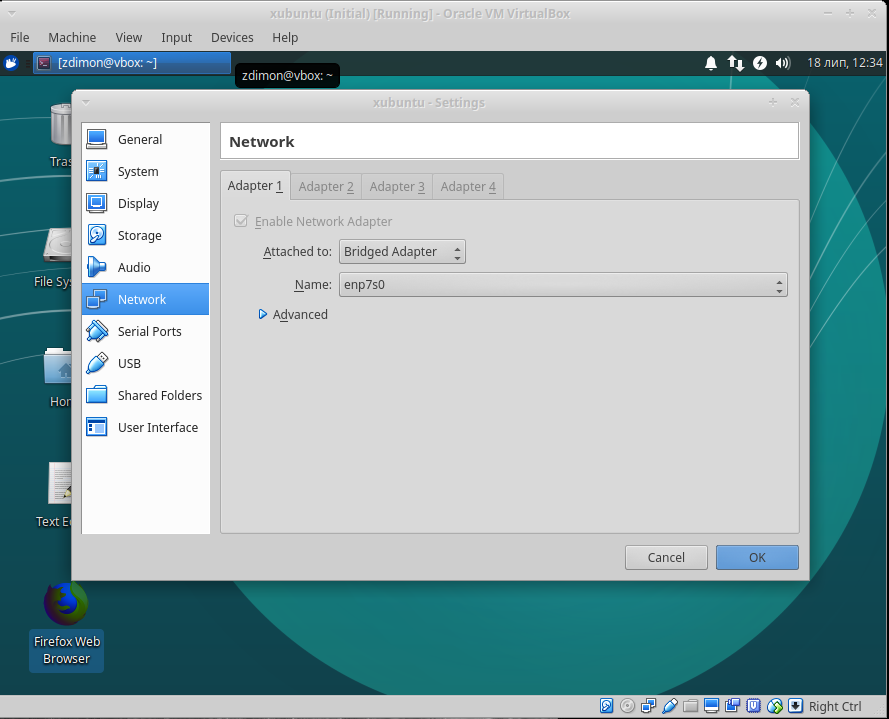

# Ручная установка необходимых инструментов.

## Вспомогательные утилиты.

    sudo apt-get install git terminator curl git unzip gedit curl pgadmin3 mc

- при работе внутри виртуалки нужны либы для клипборда на Ubuntu

    sudo apt-get install virtualbox-guest-dkms virtualbox-guest-x11
    
Отметить тут и перегрузить машину.


**Соединение ssh клиентом напрямую к виртуалке**

1. Установим ssh сервер.

    sudo apt-get install openssh-server
    
1.1. Проверим порт.
   
   netstat -lnpt | grep 22
    
2. Добавим мост.

    
  
3. Узнаем ip адресс машины.

    ip arrd show

          
  
4. Соединяемся.

    ssh username@ip-address  
    
- чтобы не вводить постоянно sudo можно перейти в суперпользователя root

    sudo -s
    
    
## PostgreSQL база.

    sudo apt-get install postgresql postgresql-contrib
    
- проверим слушается ли порт базы

    netstat -lnpt | grep 5432
    
***Установим пароль для пользователя postgres***

- перейдем в пользователя postgres


    sudo -s -u postgres

- запустим клиент


    psql

- меняем пароль


    \password postgres
    
- выходим в текущего пользователя (два раза ctrl+d)  

Соединяемся.

[](images/3.png)  

***Внешний доступ к базе из гипервизора***

- отредактируем файл настроек 

    sudo nano /etc/postgresql/10/main/pg_hba.conf

- добавим в конец

    host all all 0.0.0.0/0 trust

- отредактируем файл настроек 

    nano /etc/postgresql/10/main/postgresql.conf
    
- добавим в конец

    listen_addresses = '*'


## PHP 7.1

    sudo add-apt-repository ppa:ondrej/php
    sudo apt-get update
    sudo apt-get install php7.1
    
## Установка зависимостей Laravel.

    sudo apt-get install php7.2-mbstring php7.2-dom php7.2-pgsql php7.2-fpm php7.2-zip


## Установка PHP composer.

- качаем установщик

    curl -sS https://getcomposer.org/installer
  

- устанавливаем композер глобально.

    sudo php installer --install-dir=/usr/local/bin --filename=composer
    
Проще.

    sudo apt-get install composer
    
## Создаем папку для проектов.

    mkdir prj
    cd prj


## Тянем Laravel. 

    composer require "laravel/installer"

## Создаем новый проект.

    ./vendor/bin/laravel new blog-project
    cd blog-project
  
- проверим дев сервер.

    php artisan serve

    
## Делаем копию .env.example

    cp .env.example .env
    
    
- изменяем коннект

    DB_CONNECTION=pgsql
    DB_HOST=127.0.0.1
    DB_PORT=5432
    DB_DATABASE=blog
    DB_USERNAME=postgres
    DB_PASSWORD=password

**создаем базу данных**

    su postgres
    createdb blog
    
- разлогиниваемся из пользователя postgres по ctrl+d
        
## Запускаем миграцию

    php artisan migrate
    
    
## Настройка PHP-FPM + Nginx
    
## PHP-fpm configuration file.    

    sudo nano /etc/php/7.2/fpm/pool.d/www.conf
    
Make sure about the path to the socket file is.

    pid = /run/php/php7.2-fpm.sock
    
    
Make sure that 

    listen.owner = username
    listen.group = username
    
have the save username that in /etc/nginx/nginx.conf

    user username;
    
    
    
    
## NGIX configuration file.


```
    sudo nano /etc/nginx/sites-enabled/e-commerce
       
        
    server {
        listen 80;
        

        root /home/zdimon/www/e-commerce/origin/public/site;
        index index.php index.html index.htm index.nginx-debian.html;
        server_name ecommerce.local;

        location / {
            try_files $uri $uri/ /index.php?$query_string;
        }

        location ~ \.php$ {
                include snippets/fastcgi-php.conf;
                fastcgi_pass unix:/run/php/php7.2-fpm.sock;
        }        
        
        
    }
    
    
    server {
        listen 80;
        

        root /home/zdimon/storage1/www/e-commerce/origin/public/admin;
        index index.php index.html index.htm index.nginx-debian.html;
        server_name admin.ecommerce.local;

        location / {
            try_files $uri $uri/ /index.php?$query_string;
        }
        
        location ~ \.php$ {
                include snippets/fastcgi-php.conf;
                fastcgi_pass unix:/run/php/php7.2-fpm.sock;
        }  

        
    }
```    
    
## Alias to the localhost in /etc/hosts (optional).

    
    127.0.0.1	ecommerce.local
    127.0.0.1	admin.ecommerce.local
    
 
